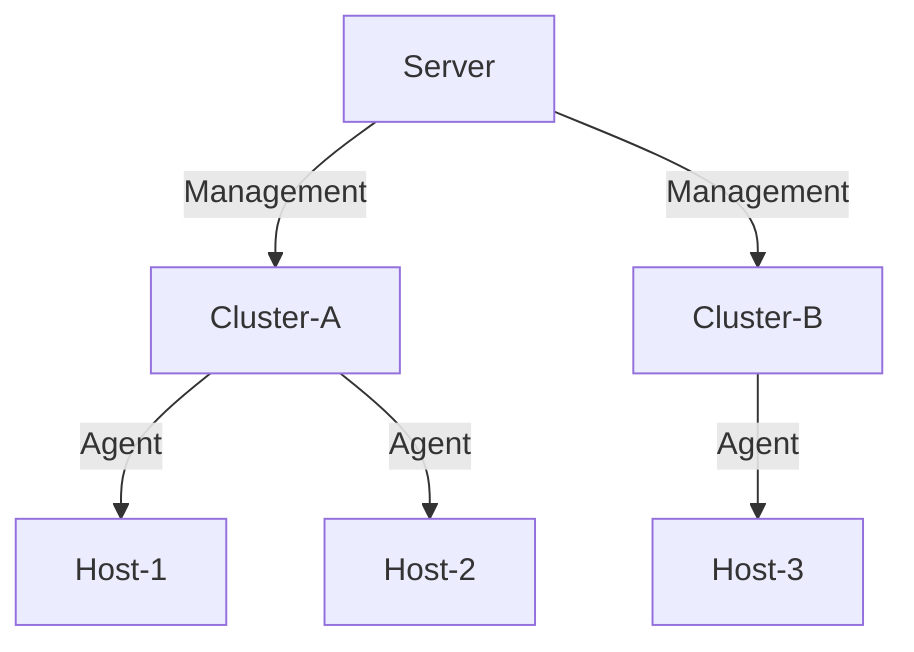
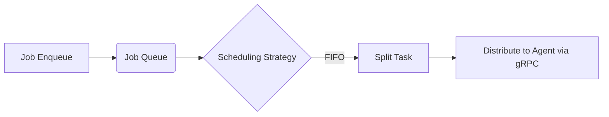

# Architecture and Design

## Hierarchical Architecture System

### Interface Layer
* **Functional Modules**:
    * **REST API**: Provide HTTP interfaces that comply with the OpenAPI 3.0 specification.
    * **Web UI**: An interactive management interface based on Vue 3.
* **Interaction Protocol**: All interface requests are transmitted via HTTP.

### Core Layer
| Module | Responsibility Description                                                                      |
|--------|-------------------------------------------------------------------------------------------------|
| Server | Cluster metadata management, Job scheduling, and global state maintenance                       |
| Agent  | Host-level service lifecycle management (deployment/start-stop/configuration)                   |
| LLM    | Generate intelligent operation and maintenance suggestions based on natural language processing |
| Stack  | Define component stacks                                                                         |
| gRPC   | Implement a two-way communication protocol between the Server and the Agent                     |
| Job    | A task execution unit that records operation status and logs                                    |

### Component Layer
* **Supported Components**: Include but not limited to ZooKeeper/Hadoop/Kafka, etc.
* **Extension Mechanism**: Define installation scripts and configuration templates for new components through the Stack module.

## Cluster Topology Rules

### Deployment Constraints
* **Service Instances**:
    * The Server runs in a single-instance mode on the Host.
    * At most one Agent instance can be deployed on each Host.
* **Resource Allocation**:
    * Each Host can only join one cluster.
    * The Agent is responsible for managing all components within the Host.
* **Communication Path**:

## Job Processing Flow

### Instruction Execution Phase
* **Request Reception**:
    * Users initiate operation requests (such as starting Kafka) through the REST API or Web UI.
    * After the Server verifies the permissions, it creates the corresponding Job record.
* **Job Scheduling**:

* **Script Execution**:
    * The Agent loads the corresponding script in the Stack.
    * Execution logs are written to the local log file in real time.

### State Management Mechanism
| State Type        | Trigger Condition                      | Handling Strategy             |
|-------------------|----------------------------------------|-------------------------------|
| PENDING           | Task created but not scheduled         | Wait for invocation           |
| RUNNING           | Task has been issued to the Agent      | Monitor the timeout threshold |
| SUCCESSFUL/FAILED | The Agent returns the execution result | Update component status       |
| CANCELED          | The preceding task fails               | Cancel subsequent tasks       | 