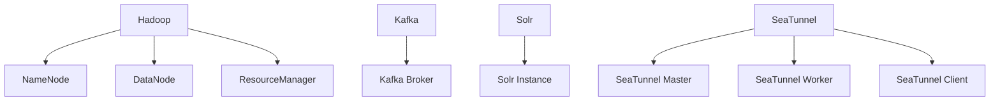

# Concepts

## Cluster
### Definition
A cluster is a logical unit composed of a group of physical or virtual hosts, used to host the distributed runtime environment for big data components. Each cluster has independent configuration space and resource isolation boundaries.

### Key Features
* **Multi Cluster**: A single Server instance can manage multiple clusters simultaneously (e.g., production clusters, test clusters, etc.).
* **Host Binding**: Each Host can only belong to one cluster.

### Stack
### Stack
#### Definition
A predefined standardized service collection that includes installation scripts, configuration templates, and dependency relationship descriptions.

#### Stack List
| Stack      | Description                                                               |  
|------------|---------------------------------------------------------------------------|  
| **Infra**  | Services shared by all clusters, such as the monitoring system Prometheus |  
| **Bigtop** | Services provided by Apache Bigtop, such as Hadoop/Hive/Spark, etc.       |  
| **Extra**  | Community-provided or custom services, such as SeaTunnel                  |  

### Service
#### Definition
A service unit running on a cluster, representing specific big data services (such as Hadoop/Hive/Spark, etc.).

#### Management
##### Configuration Management
* **Snapshots**: Supports configuration snapshot creation and management.
* **Templates**: Uses Freemarker syntax to dynamically render configuration files.

##### Status Monitoring
* **Heartbeat**: The Agent reports service health status every 30 seconds.

### Component
#### Definition
A runtime instance within a service, corresponding to specific processes or functional modules. Component-level operations (start/stop, etc.) are executed by the Agent.

#### Component Examples

## Job
### Job
#### Definition
The smallest schedulable unit initiated by users, representing a complete operation and maintenance target. For example:  
`Start Hadoop service`, `Update Spark configuration and restart`, etc.

#### Features
* **Atomicity**: The execution result of a Job has only two states: success or failure.
* **Scope**: Acts on a single cluster.
* **Lifecycle**: Forms a complete operation trajectory from creation to final state change.

### Stage
#### Definition
A logical execution unit decomposed from a Job (Job), corresponding to independent operation steps of service components. For example:  
The `Start Hadoop` Job → `Start NameNode` Stage, `Start DataNode` Stage, etc.

#### Division Principles
* **Dependency**: Components with startup order constraints must be split into independent Stages (e.g., NameNode needs to start before DataNode).
* **Isolation**: Operations of different component categories must be executed in isolation.
* **Parallelism**: Allows parallel execution of Tasks within the same Stage.

### Task
#### Definition
An execution instance of a Stage (Stage) on a specific host, representing the smallest granularity of operation instructions. For example:  
The `Start NameNode` Stage → `Start NameNode on host-01` Task, `Start NameNode on host-02` Task.

### Job Scheduling Process
#### Job Generates Stages and Tasks
After users submit operation requests via the REST API:
* The Server parses the request and validates its legitimacy.
* Generates a Stage DAG based on component dependency relationships.
* Generates a set of host-level Tasks for each Stage.
* Persists Job/Stage/Task metadata to the database (status initialized to `PENDING`).

#### Stage Scheduling Phase
The scheduler executes Stages in DAG order:
* Checks the status of preceding Stages (triggered only when all preceding Stages succeed).
* Extracts the set of Tasks in the Stage.
* Batches Tasks to the corresponding hosts for execution by the Agent.

#### Task Execution Phase
Processing flow after the Agent receives a Task:
* **Resource Pre-Check**: Verifies the installation status and dependencies of the target component.
* **Script Execution**: Invokes the predefined component operation script in the Stack.
* **Status Feedback**: Writes task logs in real time and updates the Task status to the Server.

Execution Guarantee Mechanisms:
* **Timeout**: A single Task execution timeout (default 30 minutes) is automatically marked as failed.
* **Retry**: Network exception failures can be automatically retried (up to 3 times).
* **Idempotent**: Re-executing a successful Task will not cause side effects.

#### State Management Mechanism
| State Type        | Trigger Condition                          | Handling Strategy         |  
|-------------------|--------------------------------------------|---------------------------|  
| PENDING           | Task created but not scheduled             | Wait for invocation       |  
| RUNNING           | Task in execution                          | Monitor timeout threshold |  
| SUCCESSFUL/FAILED | Task execution result                      | Update component status   |  
| CANCELED          | Task canceled (only exists for Stage/Task) | Cancel subsequent tasks   |