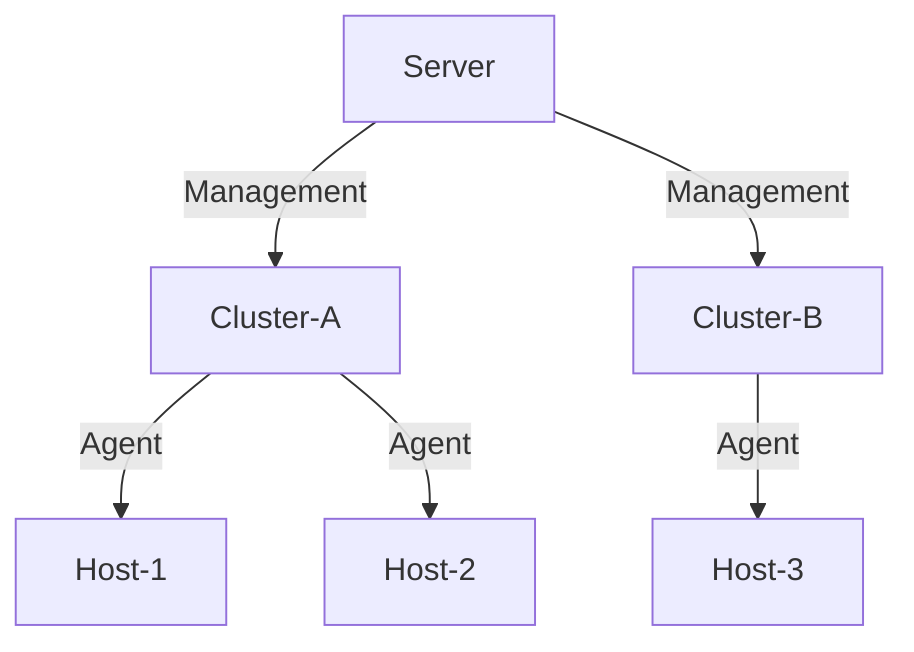

# 架构与设计

## 分层架构体系

### 接口层（Interface Layer）
* **功能模块**：
    * **REST API**：提供符合 OpenAPI 3.0 规范的HTTP接口
    * **Web UI**：基于 Vue 3 的交互式管理界面
* **交互协议**：所有接口请求均通过 HTTP 传输

### 核心层（Core Layer）
| 模块     | 职责描述                       |
|--------|----------------------------|
| Server | 集群元数据管理、Job调度、全局状态维护       |
| Agent  | 主机级服务生命周期管理（部署/启停/配置）      |
| LLM    | 基于自然语言处理的智能运维建议生成          |
| Stack  | 组件栈定义                      |
| gRPC   | 实现 Server 与 Agent 间的双向通信协议 |
| Job    | 任务执行单元，记录操作状态与日志           |

### 组件层（Component Layer）
* **支持组件**：包括但不限于: ZooKeeper/Hadoop/Kafka 等
* **扩展机制**：通过 Stack 模块定义新组件的安装脚本与配置模板

## 集群拓扑规则

### 部署约束
* **服务实例**：
    * Server 以单实例模式运行于 Host
    * 每个 Host 最多部署一个 Agent 实例
* **资源分配**：
    * 每个 Host 仅可加入一个集群
    * Agent 负责管理 Host 内的所有组件
* **通信路径**：

## 任务处理流程

### 指令执行阶段
* **请求接收**：
    * 用户通过 REST API 或 Web UI 发起操作请求（如启动 Kafka）
    * Server 验证权限后创建对应Job记录
* **任务调度**：

* **脚本执行**：
    * Agent 加载 Stack 中对应的脚本
    * 执行日志实时写入本地 Log 文件

### 状态管理机制
| 状态类型              | 触发条件           | 处理策略   |
|-------------------|----------------|--------|
| PENDING           | Task 创建未调度     | 等待调用   |
| RUNNING           | Task 已下发 Agent | 监听超时阈值 |
| SUCCESSFUL/FAILED | Agent 返回执行结果   | 更新组件状态 |
| CANCELED          | 前置任务失败         | 取消后续任务 |