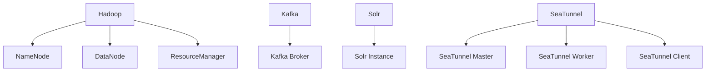

# 核心概念

## 集群
### 定义
集群是由一组物理或虚拟主机组成的逻辑单元，用于承载大数据组件的分布式运行环境。每个集群具备独立的配置空间和资源隔离边界

### 关键特性
* **多集群管理**：单个 Server 实例可同时管理多个集群（如生产集群、测试集群等）
* **主机绑定规则**：每个 Host 仅能归属一个集群

## 组件栈
### 组件栈（Stack）
#### 定义
预定义的标准化服务集合，包含安装脚本、配置模板及依赖关系描述

#### 组件栈列表
| 组件栈        | 描述                                        |
|------------|-------------------------------------------|
| **Infra**  | 所有集群共享的服务，比如监控系统 Prometheus               |
| **Bigtop** | Apache Bigtop 提供的服务，如 Hadoop/Hive/Spark 等 |
| **Extra**  | 社区提供或自定义服务，如 SeaTunnel                    |

### 服务（Service）
#### 定义
运行在集群上的服务单元，代表具体的大数据服务（如 Hadoop/Hive/Spark 等）

#### 管理维度
##### 配置管理
* **快照机制**：支持配置快照拍摄及管理
* **模板引擎**：使用 Freemarker 语法动态渲染配置文件

#### 状态监控
* **心跳机制**：Agent 每 30 秒上报服务健康状态

### 组件（Component）
#### 定义
服务内部的运行实例，对应具体进程或功能模块。组件级别的操作（启动/停止等）由 Agent 执行。

#### 组件示例

## 作业
### 作业（Job）
#### 定义
用户发起的最小可调度单元，代表一个完整的运维操作目标。例如：
`启动 Hadoop 服务`、`更新 Spark 配置并重启` 等

#### 特性
* **原子性**：Job 执行结果仅有成功/失败两种状态
* **操作域**：作用于单个集群
* **生命周期**：从创建到状态终态变更形成完整操作轨迹

### 阶段（Stage）
#### 定义
作业（Job）分解后的逻辑执行单元，对应服务组件的独立操作步骤。例如：
`启动 Hadoop` Job → `启动 NameNode` Stage、`启动 DataNode` Stage 等

#### 划分原则
* **服务依赖**：存在启动顺序约束的组件需拆分为独立 Stage（如 NameNode 需早于 DataNode 启动）
* **资源隔离**：不同组件类别的操作需隔离执行
* **并行度控制**：允许同一 Stage 内 Task 并行执行

### 任务（Task）
#### 定义
阶段（Stage）在具体主机上的执行实例，代表最小粒度的操作指令。例如：
`启动 NameNode` Stage → `启动 host-01 上的 NameNode` Task、`启动 host-02 上的 NameNode` Task

### 作业调度流程
#### Job 生成 Stages 及 Tasks
用户通过 REST API 提交操作请求后：
* Server 解析请求并校验请求合法性
* 根据组件依赖关系生成 Stage DAG
* 为每个 Stage 生成主机级别的 Task 集合
* 持久化 Job/Stage/Task 元数据至数据库（状态初始化为 `PENDING`）

#### Stage 调度阶段
调度器按 DAG 顺序执行 Stage：
* 检查前置 Stage 状态（仅当前置 Stage 全部成功时触发）
* 提取 Stage 中的 Task 集合
* 将 Task 批量推送至对应主机上交由 Agent 执行

#### Task 执行阶段
Agent 接收 Task 后的处理流程：
* **资源预检**：验证目标组件安装状态与依赖项
* **脚本执行**：调用 Stack 中预定义的组件操作脚本
* **状态回传**：实时写入任务日志并更新 Task 状态至 Server

执行保障机制：
* **超时熔断**：单个 Task 执行超时（默认 30 分钟）自动标记失败
* **重试策略**：网络异常类失败可自动重试（最大 3 次）
* **幂等设计**：重复执行已成功 Task 不会引发副作用

#### 状态管理机制
| 状态类型              | 触发条件                       | 处理策略   |
|-------------------|----------------------------|--------|
| PENDING           | 任务创建未调度                    | 等待调用   |
| RUNNING           | 任务执行中                      | 监听超时阈值 |
| SUCCESSFUL/FAILED | 任务执行结果                     | 更新组件状态 |
| CANCELED          | 该任务被取消（仅 Stage/Task 存在该状态） | 取消后续任务 |